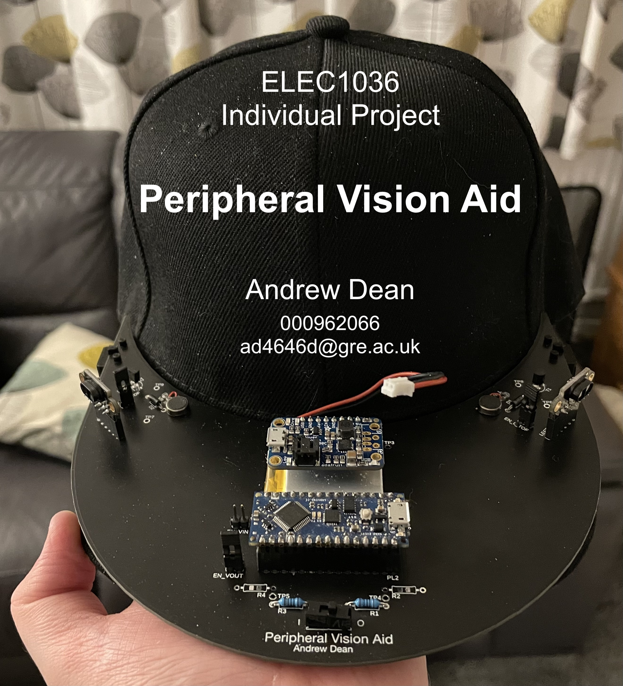

## About The Project
The aim of the project was to design and produce a prototype peripheral vision aid capable of warning the wearer of objects in their surroundings.

The final wearable prototype -seen in the title image- utilises ST VL53L1X Time-of-Flight sensors to detect objects approaching the wearer, who is then warned of them via haptic feedback.

## Contents
- [Development_Code_Archive](Development_Code_Archive/) - This contains code generated throughout the development phase of the project.
- [PeripheralVisionAid](PeripheralVisionAid/) - This is the final version of the peripheral vision aid's code.
- [Resources](Resources/)
    - **[Datasheets](Resources/Datasheets/)** - Contains; datasheet for [VL53L1X](Resources/Datasheets/vl53l1x.pdf), pinout for [Arduino Nano Every](Resources/Datasheets/ArduinoNanoEvery_Pinout.pdf) and datasheet for [Adafruit PowerBoost 500+ Charger](Resources/Datasheets/adafruit-powerboost-500-plus-charger.pdf).
    - **[ECAD_Files](Resources/ECAD_Files/)** - Contains; [Fusion 360 ECAD project file](Resources/ECAD_Files/F360_Project/), [Gerbers](Resources/ECAD_Files/Gerbers/) and the [schematic](Resources/ECAD_Files/Schematic/).
    - **[MCAD_Files](Resources/MCAD_Files/)** - Contains the step file for the baseball cap mount.

## Code Dependency
Code contained within the [Development_Code_Archive](Development_Code_Archive/) and [PeripheralVisionAid](PeripheralVisionAid/) make use of Pololu's [VL53L1X arduino library](https://github.com/pololu/vl53l1x-arduino).

## Author
This project was created by: Andrew Dean \
Student ID: 000962066 \
Email: ad4646d@gre.ac.uk
